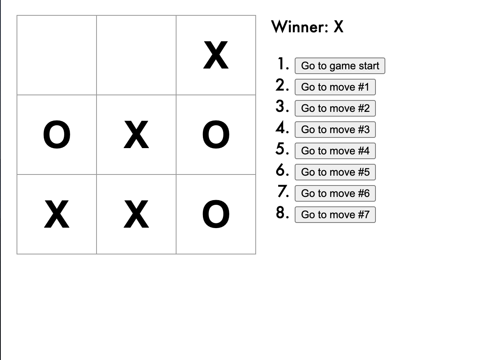

# React Tic-Tac-Toe

React's tic-tac-toe tutorial used as a refresher to React. Finished project is a funtional tic-tac-toe game which will declare a winner and allow you to see all the steps made and toggle through them

---

## Play the Game
[Tic Tac Toe](https://ashryan125.github.io/react-ticTacToe/)

---

## Built With
 

---

## Future Development

* Display the location for each move in the format (col, row) in the move history list.
* Bold the currently selected item in the move list.
* Rewrite Board to use two loops to make the squares instead of hardcoding them.
* Add a toggle button that lets you sort the moves in either ascending or descending order.
* When someone wins, highlight the three squares that caused the win.
* When no one wins, display a message about the result being a draw.

## Screenshots

---
## Contact
Please visit my [GitHub Page](https://github.com/ashryan125/) to check out this and other projects I've been a part of
  
  Contact me at ash.ryan125@gmail.com with any questions or if you'd like to collaborate.
